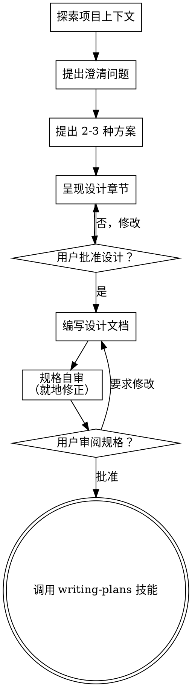

# 把想法头脑风暴成设计

通过自然的协作对话，帮助把想法转化为成型的设计和规格说明。

首先理解当前项目的上下文，然后一次问一个问题来打磨这个想法。一旦你理解了要构建什么，就呈现设计并获得用户的批准。

<HARD-GATE>
在你呈现设计并获得用户批准之前，不要调用任何实现类技能、编写任何代码、搭建任何项目，或采取任何实现动作。这适用于每一个项目，无论它看起来多么简单。
</HARD-GATE>

## 反模式："这个太简单了，不需要设计"

每个项目都要走这个流程。一个待办列表、一个单函数工具、一次配置修改——全都一样。越是"简单"的项目，未经审视的假设越会造成最严重的返工。设计可以很短（对于真正简单的项目，几句话即可），但你必须呈现它并获得批准。

## 检查清单

你必须为以下每一项创建一个任务，并按顺序完成：

1. **探索项目上下文** —— 检查文件、文档、最近的提交
2. **在恰当的时机提供可视化伴侣** —— 不要一开始就提供。当某个问题用展示比用描述更清楚时，第一次出现就当时提供（作为单独的一条消息）；获得批准后，它的浏览器标签页会为你打开。如果从来没有出现适合可视化的问题，就永远不要提供它。参见下方的"可视化伴侣"章节。
3. **提出澄清问题** —— 一次一个，理解目的/约束/成功标准
4. **提出 2-3 种方案** —— 附带权衡和你推荐的方案
5. **呈现设计** —— 按章节呈现，章节篇幅与复杂度相称，每个章节后都获得用户批准
6. **编写设计文档** —— 保存到 `docs/superpowers/specs/YYYY-MM-DD-<topic>-design.md` 并提交
7. **规格自审** —— 快速内联检查占位符、矛盾、歧义、范围（见下文）
8. **用户审阅书面规格** —— 在继续之前请用户审阅规格文件
9. **过渡到实现** —— 调用 writing-plans 技能来创建实现计划

## 流程图

**终态是调用 writing-plans。** 不要调用 frontend-design、mcp-builder 或任何其他实现类技能。你在 brainstorming 之后唯一调用的技能只有 writing-plans。

## 流程

**提问机制（怎么问）：**

- 每当一个问题让用户在若干离散选项间做选择——方案、范围权衡、偏好确认、A/B/C 决定——你都必须用 **AskUserQuestion 工具**来问，它会渲染一个交互式选项选择器。把你推荐的选项放在最前面（标注"(推荐)"），其余选项跟在后面。
- 绝不要把可选择的选项以纯文本的编号/字母列表（"1./2./A./B."）形式呈现给用户挑选。纯文本只适用于真正开放式、答案是自由文本而非选择的问题。
- 这在所有模式下都适用，包括 Plan mode，并且优先级高于下文任何关于"对话式"或"在终端中"呈现选项的指引。

**理解想法：**

- 先了解当前项目状态（文件、文档、最近提交）
- 在问细节问题之前，先评估范围：如果请求描述了多个相互独立的子系统（例如"构建一个包含聊天、文件存储、计费和分析的平台"），立即指出这一点。不要把提问花在打磨一个本应先拆分的项目的细节上。
- 如果项目对一个规格来说太大，帮助用户拆分成子项目：哪些是独立的部分、它们如何关联、应该以什么顺序构建？然后通过正常的设计流程对第一个子项目进行头脑风暴。每个子项目都有自己的 规格 → 计划 → 实现 周期。
- 对于范围合适的项目，一次问一个问题来打磨想法
- 尽可能使用选择题（通过 AskUserQuestion 工具提问）；当答案确实是自由文本时，开放式问题也可以
- 每条消息只问一个问题——如果某个话题需要更多探索，把它拆成多个问题
- 重点是理解：目的、约束、成功标准

**探索方案：**

- 提出 2-3 种不同方案，附带权衡
- 通过 AskUserQuestion 工具呈现选择——每种方案一个选项，推荐的选项放最前并标注"(推荐)"。在周围的正文中给出你的理由。
- 把你推荐的选项放在最前并解释为什么

**呈现设计：**

- 一旦你认为自己理解了要构建什么，就呈现设计
- 让每个章节的篇幅与其复杂度相称：直白的用几句话，微妙的最多 200-300 字
- 每个章节后都问一句到目前为止看起来是否合理
- 覆盖：架构、组件、数据流、错误处理、测试
- 准备好随时回头澄清任何说不通的地方

**为隔离和清晰而设计：**

- 把系统拆分成更小的单元，每个单元都有单一明确的目的、通过定义良好的接口通信，并且能被独立理解和测试
- 对于每个单元，你都应该能回答：它做什么、你怎么用它、它依赖什么？
- 别人能不读内部实现就理解一个单元做什么吗？你能不改消费者的前提下改动内部实现吗？如果不能，边界还需要打磨。
- 更小、边界更清晰的单元也更容易让你自己处理——你对能一次装入上下文的代码推理得更准确，当文件足够聚焦时你的编辑也更可靠。当一个文件变大时，往往就说明它承担了太多职责。

**在既有代码库中工作：**

- 在提出改动之前先探索现有结构。遵循既有模式。
- 当既有代码存在影响当前工作的问题（例如一个文件长得太大、边界不清、职责纠缠），把针对性的改进作为设计的一部分纳入——就像一个优秀的开发者会顺手改进自己正在工作的代码一样。
- 不要提议无关的重构。聚焦于服务于当前目标的内容。

## 设计之后

**文档：**

- 把经过验证的设计（规格）写到 `docs/superpowers/specs/YYYY-MM-DD-<topic>-design.md`
  - （用户对规格存放位置的偏好优先于此默认值）
- 如果可用，使用 elements-of-style:writing-clearly-and-concisely 技能
- 把设计文档提交到 git

**规格自审：**
写完规格文档后，用新的眼光审视它：

1. **占位符扫描：** 是否有"TBD"、"TODO"、未完成的章节或模糊的需求？修正它们。
2. **内部一致性：** 各章节是否互相矛盾？架构是否与功能描述相符？
3. **范围检查：** 它是否足够聚焦于单个实现计划，还是需要拆分？
4. **歧义检查：** 是否有需求可以被理解为两种不同含义？如果有，选定一种并写明确。

就地修正任何问题。不需要复查——修完就继续。

**用户审阅关卡：**
规格审阅循环通过后，在继续之前请用户审阅已写好的规格：

> "规格已写好并提交到 `<path>`。请审阅一下，在我们开始编写实现计划之前，告诉我是否需要任何修改。"

等待用户的回复。如果他们要求修改，做出修改并重新运行规格审阅循环。只有当用户批准后才继续。

**实现：**

- 调用 writing-plans 技能来创建详细的实现计划
- 不要调用任何其他技能。writing-plans 是下一步。

## 关键原则

- **一次一个问题** —— 不要用多个问题淹没对方
- **优先选择题** —— 在可能的情况下比开放式更容易回答，通过 AskUserQuestion 工具呈现——绝不用纯文本列表
- **可选选项一律走 AskUserQuestion** —— 任何提供离散选择的问题都用交互式选择器，不用编号/字母文本
- **毫不留情地执行 YAGNI** —— 从所有设计中移除不必要的功能
- **探索替代方案** —— 在定下来之前总是提出 2-3 种方案
- **增量验证** —— 呈现设计，得到批准后再继续
- **保持灵活** —— 当某些东西说不通时，回头澄清

## 可视化伴侣

一个基于浏览器的伴侣，用于在头脑风暴过程中展示模型、图表和可视化选项。作为一种工具存在——不是一个模式。接受这个伴侣意味着它可用于那些受益于可视化处理的问题；这并不意味着每个问题都要走浏览器。

**提供伴侣（恰逢其时）：** 不要一开始就提供它。等到一个问题用展示比用讲述更清楚时——一个真正的模型/布局/图表问题，而不仅仅是一个 UI *话题*。第一次出现这种情况时，当时就提供，作为单独的一条消息：
> "接下来这部分如果我展示给你看可能会更容易——我可以一边进行一边在浏览器标签页里准备模型、图表和对比。它还很新，可能会比较耗 token。要不要我开？我会替你打开它。"

**这个提议必须是单独的一条消息。** 只有这个提议——不要带澄清问题、总结或其他任何内容。等待用户的回复。如果他们接受，用 `--open` 启动服务器，这样他们的浏览器会自动打开第一个屏幕。如果他们拒绝，继续纯文本模式，除非他们主动提起，否则不要再提供。

**逐问题决定：** 即使用户接受了，也要对每个问题单独判断哪种机制更合适。判断标准是：**用户看到它会不会比读到它更容易理解？**

- **用浏览器**处理本身可视化的内容——模型、线框图、布局对比、架构图、并排的可视化设计
- **用 AskUserQuestion 工具**处理非可视化的选择——需求问题、概念性的 A/B/C 选择、权衡选择、范围决定。它会渲染一个交互式选择器；绝不要把这些列为纯编号/字母文本。
- **用纯终端文本**只适用于真正开放式、答案是自由文本而非选择的问题

一个关于 UI 话题的问题并不自动就是可视化问题。"在这种语境下'个性'是什么意思？"是一个概念性选择——用 AskUserQuestion。"哪种向导布局更好？"是一个可视化问题——用浏览器。

如果他们同意使用伴侣，在继续之前先阅读详细指南：
`skills/brainstorming/visual-companion.md`
