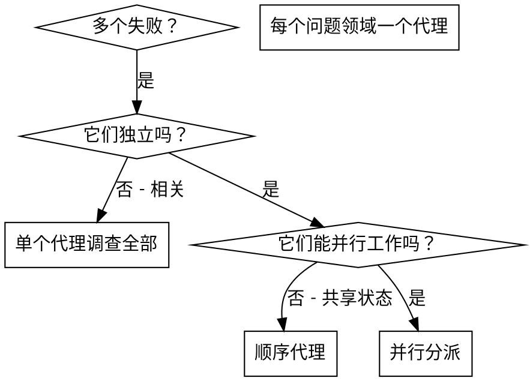

# 分派并行代理

## 概览

你把任务委派给带隔离上下文的专门代理。通过精确构造它们的指令和上下文，你确保它们保持专注并成功完成自己的任务。它们绝不应该继承你会话的上下文或历史——你构造它们恰好需要的东西。这也为你自己的协调工作保留上下文。

当你有多个不相关的失败（不同的测试文件、不同的子系统、不同的 bug），顺序调查浪费时间。每个调查都是独立的，可以并行进行。

**核心原则：** 每个独立问题领域分派一个代理。让它们并发工作。

## 何时使用



**何时使用：**
- 3+ 个测试文件因不同根因失败
- 多个子系统独立损坏
- 每个问题无需其他上下文就能理解
- 调查之间无共享状态

**何时不用：**
- 失败相关（修一个可能修了其他的）
- 需要理解完整系统状态
- 代理会互相干扰

## 模式

### 1. 识别独立领域

按什么坏了分组失败：
- 文件 A 测试：工具审批流程
- 文件 B 测试：批处理完成行为
- 文件 C 测试：中止功能

每个领域独立——修工具审批不影响中止测试。

### 2. 创建聚焦的代理任务

每个代理得到：
- **具体范围：** 一个测试文件或子系统
- **清晰目标：** 让这些测试通过
- **约束：** 不要改其他代码
- **期望输出：** 你发现并修复了什么的摘要

### 3. 并行分派

在同一个响应里发起全部三个子代理分派——它们并行运行：

```text
Subagent (general-purpose): "Fix agent-tool-abort.test.ts failures"
Subagent (general-purpose): "Fix batch-completion-behavior.test.ts failures"
Subagent (general-purpose): "Fix tool-approval-race-conditions.test.ts failures"
# All three run concurrently.
```

一个响应里多个分派调用 = 并行执行。每个响应一个 = 顺序。

### 4. 评审并集成

代理返回时：
- 读每个摘要
- 验证修复不冲突
- 运行完整测试套件
- 集成所有改动

## 代理提示词结构

好的代理提示词是：
1. **聚焦** —— 一个清晰的问题领域
2. **自包含** —— 理解问题所需的所有上下文
3. **对输出具体** —— 代理应返回什么？

```markdown
Fix the 3 failing tests in src/agents/agent-tool-abort.test.ts:

1. "should abort tool with partial output capture" - expects 'interrupted at' in message
2. "should handle mixed completed and aborted tools" - fast tool aborted instead of completed
3. "should properly track pendingToolCount" - expects 3 results but gets 0

These are timing/race condition issues. Your task:

1. Read the test file and understand what each test verifies
2. Identify root cause - timing issues or actual bugs?
3. Fix by:
   - Replacing arbitrary timeouts with event-based waiting
   - Fixing bugs in abort implementation if found
   - Adjusting test expectations if testing changed behavior

Do NOT just increase timeouts - find the real issue.

Return: Summary of what you found and what you fixed.
```

## 常见错误

**❌ 太宽：** "修所有测试"——代理迷失
**✅ 具体：** "修 agent-tool-abort.test.ts"——聚焦范围

**❌ 无上下文：** "修竞态条件"——代理不知道在哪
**✅ 上下文：** 粘贴错误信息和测试名

**❌ 无约束：** 代理可能重构一切
**✅ 约束：** "不要改生产代码"或"只修测试"

**❌ 含糊输出：** "修好它"——你不知道改了什么
**✅ 具体：** "返回根因和改动的摘要"

## 何时不使用

**相关失败：** 修一个可能修了其他的——先一起调查
**需要完整上下文：** 理解需要看到整个系统
**探索性调试：** 你还不知道什么坏了
**共享状态：** 代理会干扰（编辑相同文件、用相同资源）

## 来自会话的真实示例

**场景：** 一次大重构后跨 3 个文件的 6 个测试失败

**失败：**
- agent-tool-abort.test.ts：3 个失败（时序问题）
- batch-completion-behavior.test.ts：2 个失败（工具不执行）
- tool-approval-race-conditions.test.ts：1 个失败（执行计数 = 0）

**决策：** 独立领域——中止逻辑与批处理完成与竞态条件分开

**分派：**
```
Agent 1 → Fix agent-tool-abort.test.ts
Agent 2 → Fix batch-completion-behavior.test.ts
Agent 3 → Fix tool-approval-race-conditions.test.ts
```

**结果：**
- Agent 1：用基于事件的等待替代超时
- Agent 2：修了事件结构 bug（threadId 放错位置）
- Agent 3：加了等待异步工具执行完成

**集成：** 所有修复独立，无冲突，全套绿色

**节省时间：** 3 个问题并行解决 vs 顺序

## 关键收益

1. **并行化** —— 多个调查同时发生
2. **聚焦** —— 每个代理范围窄，要跟踪的上下文少
3. **独立** —— 代理不互相干扰
4. **速度** —— 3 个问题用 1 个的时间解决

## 验证

代理返回后：
1. **评审每个摘要** —— 理解改了什么
2. **检查冲突** —— 代理是否编辑了相同代码？
3. **运行全套** —— 验证所有修复一起工作
4. **抽查** —— 代理可能犯系统性错误

## 真实世界影响

来自调试会话（2025-10-03）：
- 跨 3 个文件的 6 个失败
- 3 个代理并行分派
- 所有调查并发完成
- 所有修复成功集成
- 代理改动之间零冲突
