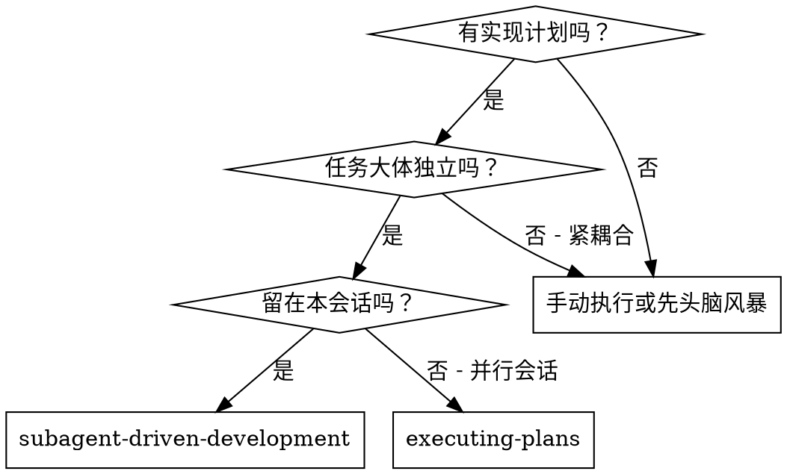
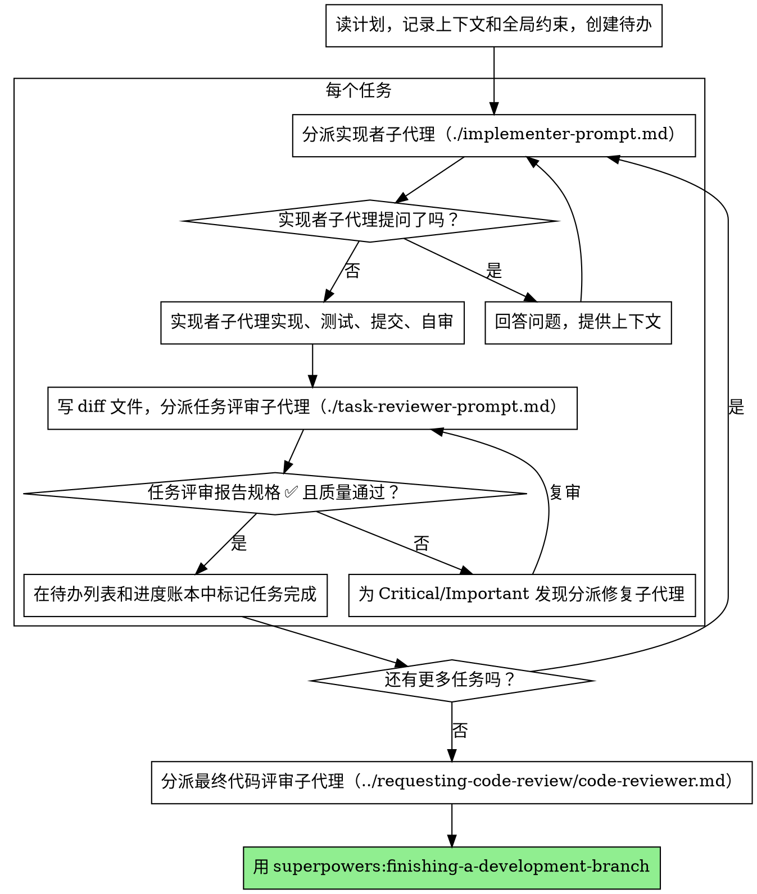

# 子代理驱动开发

通过为每个任务分派一个全新的实现者子代理来执行计划，每次之后做一次任务评审（规格合规 + 代码质量），并在最后做一次覆盖整个分支的宽泛评审。

**为什么用子代理：** 你把任务委派给带隔离上下文的专门代理。通过精确构造它们的指令和上下文，你确保它们保持专注并成功完成自己的任务。它们绝不应该继承你会话的上下文或历史——你构造它们恰好需要的东西。这也为你自己的协调工作保留上下文。

**核心原则：** 每个任务一个全新子代理 + 任务评审（规格 + 质量）+ 最后的宽泛评审 = 高质量、快迭代

**叙述：** 在工具调用之间，最多叙述一行短话——账本和工具结果承载记录。

**持续执行：** 不要在任务之间暂停去和你的搭档核对。不停顿地执行计划中的所有任务。停下来的唯一理由是：你无法解决的 BLOCKED 状态、真正阻碍推进的歧义，或所有任务完成。"我该继续吗？"的提示和进度总结浪费他们的时间——他们让你执行计划，那就执行。

## 何时使用



**对比 executing-plans（并行会话）：**
- 同一会话（无上下文切换）
- 每个任务一个全新子代理（无上下文污染）
- 每个任务后评审（规格合规 + 代码质量），最后宽泛评审
- 更快迭代（任务之间无人介入）

## 流程



## 起飞前计划评审

在分派任务 1 之前，把计划扫一遍找冲突：

- 互相矛盾、或与计划全局约束矛盾的任务
- 计划明确要求、但评审评分标准视为缺陷的任何东西（一个不断言任何东西的测试、一个逻辑块的逐字复制）

把找到的一切作为一批问题呈现给你的搭档——每个发现旁边放着要求它的计划文本，问哪个为准——在执行开始前，而不是执行中途每发现一个就打断一次。如果扫描干净，无需评论直接继续。评审循环仍是只从实现中浮现的冲突的安全网。

## 模型选择

用能胜任每个角色的最不强大的模型，以节约成本并提高速度。

**机械性实现任务**（隔离的函数、清楚的规格、1-2 个文件）：用快速、便宜的模型。当计划写得好时，大多数实现任务都是机械性的。

**集成与判断任务**（多文件协调、模式匹配、调试）：用标准模型。

**架构与设计任务**：用可用的最强大模型。
最后的整个分支评审就是其中之一——把它分派到可用的最强大模型上，而不是会话默认。

**评审任务**：选择具有相同判断力、并按 diff 的大小、复杂度和风险缩放的模型。一个小而机械的 diff 不需要最强大的模型；一个微妙的并发改动需要。

**分派子代理时始终显式指定模型。** 省略模型会继承你会话的模型——通常是最强大也最贵的——这会悄悄抵消本节。

**轮次数胜过 token 单价。** 实时时钟和上下文成本随子代理采取的轮次数而放大，而最便宜的模型在多步工作上通常多花 2-3 倍轮次——总体成本更高。把中端模型作为评审者、以及按散文描述工作的实现者的下限。当任务的计划文本包含要写的完整代码时，实现就是抄写加测试：那种实现者用最便宜档。单文件机械修复也用最便宜档。

**任务复杂度信号（实现任务）：**
- 改动 1-2 个文件、规格完整 → 便宜模型
- 改动多个文件、有集成顾虑 → 标准模型
- 需要设计判断或广泛的代码库理解 → 最强大模型

## 处理实现者状态

实现者子代理报告四种状态之一。恰当处理每一种：

**DONE：** 生成评审包（`scripts/review-package BASE HEAD`，从本技能目录——它打印它写入的唯一文件路径；BASE 是你在分派实现者之前记录的提交——绝不用 `HEAD~1`，它会悄悄丢掉多提交任务除最后一次外的所有提交），然后用打印的路径分派任务评审者。

**DONE_WITH_CONCERNS：** 实现者完成了工作但标记了疑虑。在继续前读这些疑虑。如果疑虑关乎正确性或范围，在评审前处理它们。如果它们只是观察（例如"这个文件变大了"），记下来继续评审。

**NEEDS_CONTEXT：** 实现者需要未提供的信息。提供缺失的上下文并重新分派。

**BLOCKED：** 实现者无法完成任务。评估阻塞点：
1. 如果是上下文问题，提供更多上下文并用同一模型重新分派
2. 如果任务需要更多推理，用更强大的模型重新分派
3. 如果任务太大，把它拆成更小的片段
4. 如果计划本身错了，升级给人

**绝不**忽略升级，或在没有改动的情况下强制同一模型重试。如果实现者说卡住了，就得有所改变。

## 处理评审者的 ⚠️ 项

任务评审者可能报告"⚠️ 无法从 diff 验证"的项目——活在未改动代码里或跨越任务的需求。这些不阻塞其余评审，但你必须在标记任务完成前自己解决每一个：你持有评审者缺乏的计划和跨任务上下文。如果你确认某项是真实的缺口，把它当作失败的规格评审——发回给实现者并复审。

## 构造评审者提示词

每任务评审是任务范围的关卡。宽泛评审在最后的整个分支评审时进行一次。当你填写评审者模板时：

- 不要在没有具体、任务特定理由的情况下添加开放式指令，比如"检查所有用法"或"如果有用就跑竞态测试"
- 不要让评审者重跑实现者已经在同一代码上跑过的测试——实现者的报告承载测试证据
- 不要替评审者预判发现——绝不指示评审者忽略或不标记某个具体问题。如果你认为某个发现会是误报，让评审者提出来并在评审循环中裁决。如果你正在写的提示词里有"不要标记"、"不要把 X 当缺陷"、"至多 Minor"、或"计划选择了"——停下：你在预判，通常是为了省掉一次评审循环。
- 你递给评审者的全局约束块是它的注意力透镜。从计划的全局约束章节或规格里逐字复制有约束力的要求：确切值、确切格式，以及组件之间陈述的关系（"与 X 相同的布局"、"匹配 Y"）。评审者的模板已经承载了流程规则（YAGNI、测试卫生、评审方法）——约束块是为本项目规格所要求的东西。
- 把 diff 作为文件递给评审者：运行本技能的 `scripts/review-package BASE HEAD`，把它打印的文件路径递给评审者（或不用 bash：对该范围运行 `git log --oneline`、`git diff --stat` 和 `git diff -U10`，重定向到一个唯一命名的文件）。输出永远不进入你自己的上下文，而评审者用一次 Read 调用就能看到提交列表、stat 摘要和带上下文的完整 diff。使用你在分派实现者之前记录的 BASE——绝不用 `HEAD~1`，它会悄悄截断多提交任务。
- 一次分派提示词描述一个任务，而非会话的历史。不要把累积的先前任务摘要（"任务 1-3 之后的状态"）粘进后续分派——一个真实会话的分派达到 42k 字符，其中 99% 是粘贴的历史。一个全新子代理需要它的任务、它触及的接口，以及全局约束。仅此而已。
- 为 Critical 和 Important 发现分派修复子代理。边做边把 Minor 发现记进进度账本，并让最后的整个分支评审指向那个列表，以便它分诊哪些必须在合并前修复。一份没人读的汇总就是悄悄丢弃。
- 一个标记为计划要求的发现——或任何与计划文本要求相冲突的发现——是人的决定，就像任何计划矛盾：把发现和计划文本都呈现出来，问哪个为准。不要因为计划要求就驳回发现，也不要在没问的情况下分派一个与计划矛盾的修复。
- 最后的整个分支评审也得到一个包：运行 `scripts/review-package MERGE_BASE HEAD`（MERGE_BASE = 分支起始的提交，例如 `git merge-base main HEAD`），并在最终评审分派里包含打印的路径，这样最终评审者读一个文件，而不是用 git 命令重新推导分支 diff。
- 每次修复分派都带实现者契约：修复子代理重跑覆盖其改动的测试并报告结果。在分派中点出覆盖的测试文件——一行修复不需要整个套件。在重新分派评审者之前，确认修复报告包含覆盖测试、运行的命令和输出；三者都齐了再分派复审。
- 如果最后的整个分支评审返回发现，用完整的发现列表分派一个修复子代理——而非每个发现一个修复者。每发现一个修复者各自重建上下文并重跑套件；一个真实会话的最终评审修复波次比它所有任务加起来还贵。

## 文件交接

你粘进分派提示词的一切——以及子代理打印回来的一切——都会在会话余下时间里驻留在你的上下文中，并在之后每一轮被重读。把产物作为文件交接：

- **任务简报：** 在分派实现者之前，运行本技能的 `scripts/task-brief PLAN_FILE N`——它把任务的完整文本提取到一个唯一命名的文件并打印路径。组织分派，让简报保持为需求的唯一来源。你的分派应当包含：(1) 一句话说这个任务在项目中处于什么位置；(2) 简报路径，介绍为"先读这个——它是你的需求，含要逐字使用的确切值"；(3) 简报无法知道的、来自更早任务的接口和决策；(4) 你在简报中注意到的任何歧义的解决；(5) 报告文件路径和报告契约。确切值（数字、魔法字符串、签名、测试用例）只出现在简报里。
- **报告文件：** 以简报命名实现者的报告文件（简报 `…/task-N-brief.md` → 报告 `…/task-N-report.md`），并放进分派提示词。实现者在那里写完整报告，只返回状态、提交、一行测试摘要和疑虑。
- **评审者输入：** 任务评审者得到三个路径——同一个简报文件、报告文件和评审包——加上约束该任务的全局约束。
- 修复分派把它们的修复报告（含测试结果）追加到同一报告文件，并返回简短摘要；复审读更新后的文件。

## 持久进度

对话记忆无法在压缩中存活。在真实会话中，丢了位置的控制者重新分派了整个已完成任务序列——这是观察到的最昂贵的单一失败。在账本文件中跟踪进度，而不仅是在待办里。

- 在技能开始时，检查账本：
  `cat "$(git rev-parse --show-toplevel)/.superpowers/sdd/progress.md"`。那里列为完成的任务是 DONE——不要重新分派；从第一个未标记完成的任务恢复。
- 当一个任务的评审干净返回时，在你做其他记账的同一消息里追加一行到账本：
  `Task N: complete (commits <base7>..<head7>, review clean)`。
- 账本是你的恢复地图：它命名的提交即使你的上下文不再记得创建过它们，也存在于 git 中。压缩之后，相信账本和 `git log`，胜过你自己的回忆。
- `git clean -fdx` 会销毁账本（它是被 git 忽略的临时文件）；如果发生，从 `git log` 恢复。

## 提示词模板

- [implementer-prompt.md](implementer-prompt.md) - 分派实现者子代理
- [task-reviewer-prompt.md](task-reviewer-prompt.md) - 分派任务评审子代理（规格合规 + 代码质量）
- 最后的整个分支评审：用 superpowers:requesting-code-review 的 [code-reviewer.md](../requesting-code-review/code-reviewer.md)

## 示例工作流

```
你：我在用子代理驱动开发来执行这个计划。

[读一次计划文件：docs/superpowers/plans/feature-plan.md]
[为所有任务创建待办]

任务 1：Hook 安装脚本

[为任务 1 运行 task-brief；用简报 + 报告路径 + 上下文分派实现者]

实现者："开始之前——hook 该装在用户级还是系统级？"

你："用户级（~/.config/superpowers/hooks/）"

实现者："明白。正在实现……"
[之后] 实现者：
  - 实现了 install-hook 命令
  - 加了测试，5/5 通过
  - 自审：发现漏了 --force flag，加上了
  - 提交

[运行 review-package，用打印的路径分派任务评审者]
任务评审者：规格 ✅ —— 所有需求满足，无多余。
  优点：测试覆盖好，干净。问题：无。任务质量：通过。

[标记任务 1 完成]

任务 2：恢复模式

[为任务 2 运行 task-brief；用简报 + 报告路径 + 上下文分派实现者]

实现者：[无问题，继续]
实现者：
  - 加了 verify/repair 模式
  - 8/8 测试通过
  - 自审：一切良好
  - 提交

[运行 review-package，用打印的路径分派任务评审者]
任务评审者：规格 ❌：
  - 缺失：进度上报（规格说"每 100 项报告一次"）
  - 多余：加了 --json flag（未要求）
  问题（Important）：魔法数字（100）

[用所有发现分派修复子代理]
修复者：移除 --json flag，加了进度上报，提取 PROGRESS_INTERVAL 常量

[任务评审者再次评审]
任务评审者：规格 ✅。任务质量：通过。

[标记任务 2 完成]

……

[所有任务之后]
[分派最终 code-reviewer]
最终评审者：所有需求满足，可合并

完成！
```

## 优势

**对比手动执行：**
- 子代理自然遵循 TDD
- 每个任务全新上下文（无混淆）
- 并行安全（子代理不互相干扰）
- 子代理可以提问（工作之前和期间）

**对比 executing-plans：**
- 同一会话（无交接）
- 持续推进（无等待）
- 评审检查点自动化

**效率收益：**
- 控制者精确策划需要什么上下文；大宗产物作为文件移动，而非粘贴文本
- 子代理预先得到完整信息
- 问题在工作开始前浮现（而非之后）

**质量关卡：**
- 自审在交接前捕获问题
- 任务评审带两个裁定：规格合规和代码质量
- 评审循环确保修复真正生效
- 规格合规防止过度/不足构建
- 代码质量确保实现构建良好

**成本：**
- 更多子代理调用（每任务实现者 + 评审者）
- 控制者做更多准备工作（预先提取所有任务）
- 评审循环增加迭代
- 但尽早捕获问题（比事后调试便宜）

## 红旗

**绝不：**
- 未经用户明确同意就在 main/master 分支上开始实现
- 跳过任务评审，或接受缺任一裁定的报告（规格合规和任务质量两者都必需）
- 带着未修复的问题继续
- 并行分派多个实现子代理（冲突）
- 让子代理读整个计划文件（改为递给它任务简报——`scripts/task-brief`）
- 跳过背景设定上下文（子代理需要理解任务处于什么位置）
- 忽略子代理的问题（让它们继续前先回答）
- 在规格合规上接受"差不多就行"（评审者发现规格问题 = 没完成）
- 跳过评审循环（评审者发现问题 = 实现者修复 = 再评审）
- 让实现者自审替代真实评审（两者都需要）
- 告诉评审者不要标记什么，或在分派提示词中预判发现的严重性（"至多当作 Minor"）——计划的示例代码是起点，不是其弱点被有意选择的证据
- 没有 diff 文件就分派任务评审者——先生成它（`scripts/review-package BASE HEAD`）并在提示词中点名打印的路径
- 在评审有未解决的 Critical/Important 问题时进入下一个任务
- 重新分派进度账本已标记完成的任务——在任何压缩或恢复后检查账本（和 `git log`）

**如果子代理提问：**
- 清楚完整地回答
- 如需要提供额外上下文
- 不要催促它们进入实现

**如果评审者发现问题：**
- 实现者（同一子代理）修复它们
- 评审者再次评审
- 重复直到通过
- 不要跳过复审

**如果子代理任务失败：**
- 用具体指令分派修复子代理
- 不要手动尝试修复（上下文污染）

## 集成

**必需的工作流技能：**
- **superpowers:using-git-worktrees** - 确保隔离工作区（创建一个或验证既有的）
- **superpowers:writing-plans** - 创建本技能执行的计划
- **superpowers:requesting-code-review** - 最后整个分支评审的代码评审模板
- **superpowers:finishing-a-development-branch** - 所有任务完成后完成开发

**子代理应当使用：**
- **superpowers:test-driven-development** - 子代理为每个任务遵循 TDD

**替代工作流：**
- **superpowers:executing-plans** - 用于并行会话而非同会话执行
