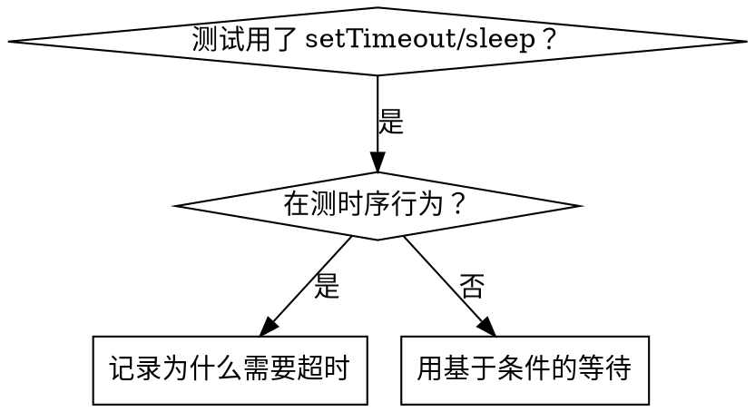

# 基于条件的等待

## 概览

Flaky 测试常常用任意延迟来猜时序。这制造了竞态条件：测试在快机器上通过，但在负载下或 CI 中失败。

**核心原则：** 等你真正关心的实际条件，而非对要多久的猜测。

## 何时使用



**何时使用：**
- 测试有任意延迟（`setTimeout`、`sleep`、`time.sleep()`）
- 测试 flaky（有时通过，负载下失败）
- 测试并行运行时超时
- 等待异步操作完成

**何时不用：**
- 在测真实时序行为（防抖、节流间隔）
- 如果用任意超时，始终记录为什么

## 核心模式

```typescript
// ❌ 之前：猜时序
await new Promise(r => setTimeout(r, 50));
const result = getResult();
expect(result).toBeDefined();

// ✅ 之后：等条件
await waitFor(() => getResult() !== undefined);
const result = getResult();
expect(result).toBeDefined();
```

## 快速模式

| 场景 | 模式 |
|----------|---------|
| 等事件 | `waitFor(() => events.find(e => e.type === 'DONE'))` |
| 等状态 | `waitFor(() => machine.state === 'ready')` |
| 等数量 | `waitFor(() => items.length >= 5)` |
| 等文件 | `waitFor(() => fs.existsSync(path))` |
| 复杂条件 | `waitFor(() => obj.ready && obj.value > 10)` |

## 实现

通用轮询函数：
```typescript
async function waitFor<T>(
  condition: () => T | undefined | null | false,
  description: string,
  timeoutMs = 5000
): Promise<T> {
  const startTime = Date.now();

  while (true) {
    const result = condition();
    if (result) return result;

    if (Date.now() - startTime > timeoutMs) {
      throw new Error(`Timeout waiting for ${description} after ${timeoutMs}ms`);
    }

    await new Promise(r => setTimeout(r, 10)); // 每 10ms 轮询一次
  }
}
```

本目录下的 `condition-based-waiting-example.ts` 有带领域特定 helper（`waitForEvent`、`waitForEventCount`、`waitForEventMatch`）的完整实现，来自真实调试会话。

## 常见错误

**❌ 轮询太快：** `setTimeout(check, 1)` —— 浪费 CPU
**✅ 修正：** 每 10ms 轮询

**❌ 没有超时：** 条件永不满足就永远循环
**✅ 修正：** 始终包含带清楚错误的超时

**❌ 陈旧数据：** 在循环前缓存状态
**✅ 修正：** 在循环内调用 getter 获取新数据

## 当任意超时才是正确的时候

```typescript
// 工具每 100ms tick 一次——需要 2 个 tick 来验证部分输出
await waitForEvent(manager, 'TOOL_STARTED'); // 先：等触发条件
await new Promise(r => setTimeout(r, 200));   // 后：等时序行为
// 200ms = 100ms 间隔的 2 个 tick——有文档、有依据
```

**要求：**
1. 先等触发条件
2. 基于已知时序（而非猜测）
3. 注释解释为什么

## 真实世界影响

来自调试会话（2025-10-03）：
- 修了 3 个文件中的 15 个 flaky 测试
- 通过率：60% → 100%
- 执行时间：快 40%
- 不再有竞态条件
