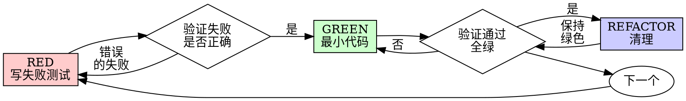

# 测试驱动开发（TDD）

## 概览

先写测试。看它失败。写最少的代码让它通过。

**核心原则：** 如果你没有看着测试失败，你就不知道它测的是不是对的东西。

**违反规则的字面就是违反规则的精神。**

## 何时使用

**总是：**
- 新功能
- 修 bug
- 重构
- 行为变更

**例外（问你的搭档）：**
- 一次性原型
- 生成的代码
- 配置文件

在想"就这一次跳过 TDD"？停下。那是合理化。

## 铁律

```
没有先写失败测试，就没有生产代码
```

先写代码再写测试？删掉它。从头来。

**没有例外：**
- 不要把它当作"参考"保留
- 不要在写测试时"改造"它
- 不要看它
- 删除就是删除

从测试出发重新实现。就这样。

## Red-Green-Refactor



### RED - 写失败测试

写一个最小的测试，展示应该发生什么。

<Good>
```typescript
test('retries failed operations 3 times', async () => {
  let attempts = 0;
  const operation = () => {
    attempts++;
    if (attempts < 3) throw new Error('fail');
    return 'success';
  };

  const result = await retryOperation(operation);

  expect(result).toBe('success');
  expect(attempts).toBe(3);
});
```
名字清楚，测真实行为，只测一件事
</Good>

<Bad>
```typescript
test('retry works', async () => {
  const mock = jest.fn()
    .mockRejectedValueOnce(new Error())
    .mockRejectedValueOnce(new Error())
    .mockResolvedValueOnce('success');
  await retryOperation(mock);
  expect(mock).toHaveBeenCalledTimes(3);
});
```
名字含糊，测的是 mock 而非代码
</Bad>

**要求：**
- 一个行为
- 清楚的名字
- 真实代码（除非不可避免，否则不用 mock）

### 验证 RED - 看它失败

**强制。绝不跳过。**

```bash
npm test path/to/test.test.ts
```

确认：
- 测试失败（不是报错）
- 失败信息符合预期
- 因为功能缺失而失败（不是笔误）

**测试通过？** 你测的是既有行为。修正测试。

**测试报错？** 修正错误，重新运行，直到它正确地失败。

### GREEN - 最小代码

写最简单的代码让测试通过。

<Good>
```typescript
async function retryOperation<T>(fn: () => Promise<T>): Promise<T> {
  for (let i = 0; i < 3; i++) {
    try {
      return await fn();
    } catch (e) {
      if (i === 2) throw e;
    }
  }
  throw new Error('unreachable');
}
```
刚好够通过
</Good>

<Bad>
```typescript
async function retryOperation<T>(
  fn: () => Promise<T>,
  options?: {
    maxRetries?: number;
    backoff?: 'linear' | 'exponential';
    onRetry?: (attempt: number) => void;
  }
): Promise<T> {
  // YAGNI（你不会需要它）
}
```
过度设计
</Bad>

不要加功能、重构其他代码，或"改进"超出测试的范围。

### 验证 GREEN - 看它通过

**强制。**

```bash
npm test path/to/test.test.ts
```

确认：
- 测试通过
- 其他测试仍然通过
- 输出干净（无错误、警告）

**测试失败？** 修代码，不是修测试。

**其他测试失败？** 立即修。

### REFACTOR - 清理

只在绿色之后：
- 移除重复
- 改进命名
- 提取 helper

保持测试绿色。不要加行为。

### 重复

为下一个功能写下一个失败测试。

## 好测试

| 质量 | 好 | 坏 |
|---------|------|-----|
| **最小** | 一件事。名字里有"and"？拆开它。 | `test('validates email and domain and whitespace')` |
| **清楚** | 名字描述行为 | `test('test1')` |
| **体现意图** | 展示期望的 API | 模糊化了代码该做什么 |

## 为什么顺序重要

**"我事后写测试来验证它能工作"**

代码之后写的测试会立即通过。立即通过什么都证明不了：
- 可能测错了东西
- 可能测的是实现，而非行为
- 可能漏了你忘记的边界情况
- 你从没看到它捕获 bug

测试优先强迫你看着测试失败，证明它确实测了东西。

**"我已经手动测了所有边界情况"**

手动测试是临时的。你以为测了一切，但：
- 没有记录你测了什么
- 代码变更时无法重跑
- 压力下容易忘记情况
- "我试的时候能工作" ≠ 全面

自动化测试是系统化的。它们每次以相同方式运行。

**"删掉 X 小时的工作太浪费"**

沉没成本谬误。时间已经没了。你现在的选择：
- 删掉并用 TDD 重写（再 X 小时，高置信）
- 保留它并事后加测试（30 分钟，低置信，可能有 bug）

"浪费"是保留你无法信任的代码。没有真实测试的可工作代码是技术债。

**"TDD 是教条的，务实意味着变通"**

TDD 就是务实的：
- 提交前找 bug（比事后调试快）
- 防止回归（测试立即捕获破坏）
- 记录行为（测试展示如何使用代码）
- 使重构成为可能（自由改动，测试捕获破坏）

"务实"的捷径 = 在生产中调试 = 更慢。

**"事后测试能达到同样目的——这是精神而非仪式"**

不。事后测试回答"这是干什么的？" 先写测试回答"这应该干什么？"

事后测试受你的实现偏见影响。你测的是你构建的，而非要求的。你验证的是你记得的边界情况，而非发现的。

先写测试强迫在实现前发现边界情况。事后测试验证你记住了一切（你没有）。

30 分钟的事后测试 ≠ TDD。你得到了覆盖率，失去了"测试有效"的证明。

## 常见合理化

| 借口 | 现实 |
|--------|---------|
| "太简单不用测" | 简单代码也会坏。测试只需 30 秒。 |
| "我事后测" | 立即通过的测试什么都证明不了。 |
| "事后测试能达到同样目的" | 事后测试 = "这是干什么的？" 先写测试 = "这应该干什么？" |
| "已经手动测过了" | 临时 ≠ 系统化。没记录，无法重跑。 |
| "删掉 X 小时太浪费" | 沉没成本谬误。保留未验证的代码是技术债。 |
| "保留作参考，先写测试" | 你会改造它。那就是事后测试。删除就是删除。 |
| "需要先探索" | 可以。扔掉探索，用 TDD 从头来。 |
| "测试难 = 设计不清" | 听测试的。难测 = 难用。 |
| "TDD 会拖慢我" | TDD 比调试快。务实 = 先写测试。 |
| "手动测试更快" | 手动测证明不了边界情况。每次改动你都要重测。 |
| "既有代码没测试" | 你在改进它。为既有代码加测试。 |

## 红旗 - 停下并从头来

- 先写代码再写测试
- 实现之后才写测试
- 测试立即通过
- 说不出测试为什么失败
- "以后"再加测试
- 合理化"就这一次"
- "我已经手动测过了"
- "事后测试能达到同样目的"
- "这关乎精神而非仪式"
- "保留作参考"或"改造既有代码"
- "已经花了 X 小时，删掉太浪费"
- "TDD 是教条的，我很务实"
- "这次不同，因为……"

**以上所有都意味着：删掉代码。用 TDD 从头来。**

## 示例：修 bug

**Bug：** 空邮箱被接受

**RED**
```typescript
test('rejects empty email', async () => {
  const result = await submitForm({ email: '' });
  expect(result.error).toBe('Email required');
});
```

**验证 RED**
```bash
$ npm test
FAIL: expected 'Email required', got undefined
```

**GREEN**
```typescript
function submitForm(data: FormData) {
  if (!data.email?.trim()) {
    return { error: 'Email required' };
  }
  // ...
}
```

**验证 GREEN**
```bash
$ npm test
PASS
```

**REFACTOR**
如有需要，为多个字段提取校验。

## 验证清单

在标记工作完成之前：

- [ ] 每个新函数/方法都有测试
- [ ] 实现前看着每个测试失败
- [ ] 每个测试都因预期原因失败（功能缺失，而非笔误）
- [ ] 写了最少的代码让每个测试通过
- [ ] 所有测试通过
- [ ] 输出干净（无错误、警告）
- [ ] 测试用真实代码（仅在不可避免时才用 mock）
- [ ] 边界情况和错误都已覆盖

不能勾选所有框？你跳过了 TDD。从头来。

## 卡住时

| 问题 | 解决方案 |
|---------|----------|
| 不知道怎么测 | 写你期望的 API。先写断言。问你的搭档。 |
| 测试太复杂 | 设计太复杂。简化接口。 |
| 必须 mock 一切 | 代码耦合太紧。用依赖注入。 |
| 测试 setup 巨大 | 提取 helper。仍然复杂？简化设计。 |

## 调试集成

发现 bug？写一个复现它的失败测试。遵循 TDD 循环。测试证明修复并防止回归。

绝不没有测试就修 bug。

## 测试反模式

在添加 mock 或测试工具时，读 [testing-anti-patterns.md](testing-anti-patterns.md) 以避免常见坑：
- 测 mock 行为而非真实行为
- 给生产类添加仅供测试的方法
- 不理解依赖就 mock

## 最终规则

```
生产代码 → 测试存在且先失败过
否则 → 不是 TDD
```

没有你搭档的许可，没有例外。
