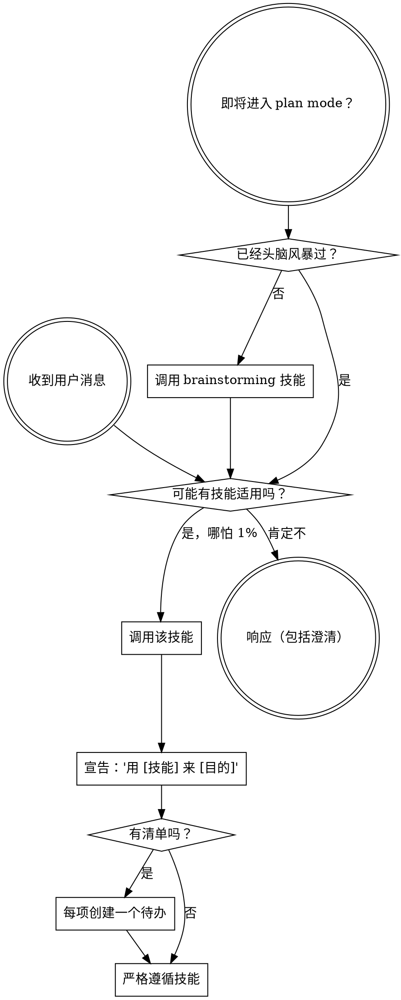

<SUBAGENT-STOP>
如果你是被分派来执行某个具体任务的子代理，跳过此技能。
</SUBAGENT-STOP>

<EXTREMELY-IMPORTANT>
如果你认为有哪怕 1% 的可能某个技能适用于你正在做的事，你绝对必须调用该技能。

如果某个技能适用于你的任务，你没有选择。你必须使用它。

这不可协商。这不是可选的。你无法把它合理化掉。
</EXTREMELY-IMPORTANT>

## 指令优先级

Superpowers 技能覆盖默认系统提示行为，但**用户指令始终优先**：

1. **用户的显式指令**（CLAUDE.md、GEMINI.md、AGENTS.md、直接请求）—— 最高优先级
2. **Superpowers 技能** —— 在冲突处覆盖默认系统行为
3. **默认系统提示** —— 最低优先级

如果 CLAUDE.md、GEMINI.md 或 AGENTS.md 说"不要用 TDD"，而某个技能说"总是用 TDD"，遵循用户的指令。用户掌控。

## 如何访问技能

**绝不要用文件工具手动读技能文件** —— 始终用你平台的技能加载机制，以便技能被正确激活。

**在 Claude Code 中：** 用 `Skill` 工具。当你调用一个技能时，其内容被加载并呈现给你——直接遵循它。

**在 Codex 中：** 技能原生加载。遵循技能激活时呈现的指令。

**在 Copilot CLI 中：** 用 `skill` 工具。技能从已安装的插件自动发现。

**在 Gemini CLI 中：** 技能通过 `activate_skill` 工具激活。Gemini 在会话开始时加载技能元数据，并按需激活完整内容。

**在其他环境中：** 查阅你平台的文档了解技能如何加载。

## 平台适配

技能用动作说话（"分派一个子代理"、"创建一个待办"、"读一个文件"），而非点名某个运行时的工具。关于按平台的工具等价物和指令文件约定，见 [claude-code-tools.md](references/claude-code-tools.md)、[codex-tools.md](references/codex-tools.md)、[copilot-tools.md](references/copilot-tools.md)、[gemini-tools.md](references/gemini-tools.md)、[pi-tools.md](references/pi-tools.md) 和 [antigravity-tools.md](references/antigravity-tools.md)。Gemini CLI 用户通过 GEMINI.md 自动加载工具映射。

# 使用技能

## 规则

**在任何响应或动作之前，调用相关或被请求的技能。** 哪怕只有 1% 的可能某个技能适用，也意味着你应该调用该技能来检查。如果一个被调用的技能对当前情况是错的，你不需要用它。

## 红旗

这些想法意味着停下——你在合理化：

| 想法 | 现实 |
|---------|---------|
| "这只是个简单问题" | 问题就是任务。检查技能。 |
| "我需要先更多上下文" | 技能检查在澄清问题之前。 |
| "让我先探索代码库" | 技能告诉你如何探索。先检查。 |
| "我可以快速查 git/文件" | 文件缺乏对话上下文。检查技能。 |
| "让我先收集信息" | 技能告诉你如何收集信息。 |
| "这不需要正式技能" | 如果技能存在，就用。 |
| "我记得这个技能" | 技领会演进。读当前版本。 |
| "这不算任务" | 行动 = 任务。检查技能。 |
| "这个技能是杀鸡用牛刀" | 简单的事会变复杂。用它。 |
| "我就先做这一件事" | 在做任何事之前先检查。 |
| "这感觉很有成效" | 无纪律的行动浪费时间。技能防止这个。 |
| "我知道那是什么意思" | 知道概念 ≠ 使用技能。调用它。 |

## 技能优先级

当多个技能可能适用时，用此顺序：

1. **流程技能优先**（brainstorming、systematic-debugging）—— 它们决定如何着手任务
2. **实现技能其次**（frontend-design、mcp-builder）—— 它们指导执行

"我们来构建 X" → 先 brainstorming，再实现技能。
"修这个 bug" → 先 systematic-debugging，再领域特定技能。

## 技能类型

**刚性**（TDD、systematic-debugging）：严格遵循。不要把纪律改造掉。

**灵活**（模式）：把原则适配到上下文。

技能本身告诉你它是哪种。

## 用户指令

指令说做什么，而非怎么做。"加 X"或"修 Y"不意味着跳过工作流。
