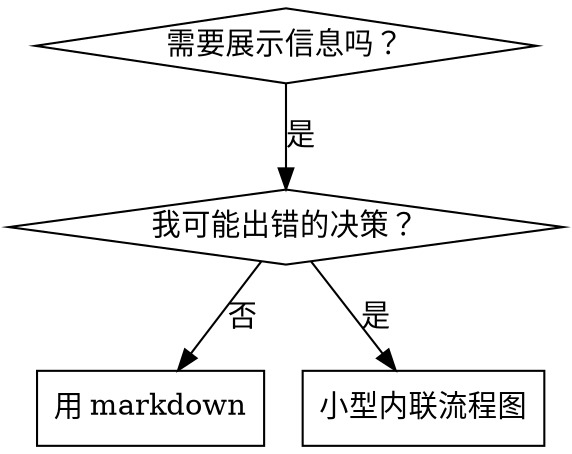

# 编写技能

## 概览

**编写技能就是把 TDD 应用到过程文档上。**

**个人技能位于你的运行时的 skills 目录中** —— 参见 [claude-code-tools.md](../using-superpowers/references/claude-code-tools.md)、[codex-tools.md](../using-superpowers/references/codex-tools.md)、[copilot-tools.md](../using-superpowers/references/copilot-tools.md) 或 [gemini-tools.md](../using-superpowers/references/gemini-tools.md) 查看你运行时上的路径。Codex、Copilot CLI 和 Gemini CLI 也都把 `~/.agents/skills/` 识别为跨运行时别名。

你编写测试用例（带子代理的压力场景），看它们失败（基线行为），编写技能（文档），看测试通过（代理顺从），然后重构（堵上漏洞）。

**核心原则：** 如果你没有看着一个代理在没有该技能时失败，你就不知道这个技能教的东西对不对。

**必须的背景：** 在使用此技能之前，你必须理解 superpowers:test-driven-development。那个技能定义了基础的 RED-GREEN-REFACTOR 循环。本技能把 TDD 适配到文档上。

**官方指引：** 关于 Anthropic 官方的技能编写最佳实践，参见 anthropic-best-practices.md。该文档提供了额外的模式和指引，与本技能中以 TDD 为核心的方法互为补充。

## 什么是技能？

**技能（skill）**是一份关于经过验证的技巧、模式或工具的参考指南。技能帮助未来的代理找到并应用有效的方法。

**技能是：** 可复用的技巧、模式、工具、参考指南

**技能不是：** 关于你某次如何解决问题的叙事

## 技能的 TDD 映射

| TDD 概念 | 技能创建 |
|-------------|----------------|
| **测试用例** | 带子代理的压力场景 |
| **生产代码** | 技能文档（SKILL.md） |
| **测试失败（RED）** | 代理在没有技能时违规（基线） |
| **测试通过（GREEN）** | 代理在有技能时顺从 |
| **重构** | 在保持顺从的同时堵上漏洞 |
| **先写测试** | 在编写技能之前先跑基线场景 |
| **看着它失败** | 逐字记录代理使用的合理化 |
| **最小代码** | 编写针对那些具体违规的技能 |
| **看着它通过** | 验证代理现在顺从 |
| **重构循环** | 找到新的合理化 → 堵上 → 重新验证 |

整个技能创建过程遵循 RED-GREEN-REFACTOR。

## 何时创建技能

**创建，当：**
- 某个技巧对你来说不是显而易见的
- 你会跨项目再次引用它
- 模式适用面广（非项目特定）
- 其他人会受益

**不要为以下情况创建：**
- 一次性的解决方案
- 在别处有充分文档的标准实践
- 项目特定的约定（放进你的指令文件）
- 机械性约束（如果可以用正则/校验强制，就自动化它——把文档留给需要判断的情况）

## 技能类型

### 技巧（Technique）
带步骤的具体方法（condition-based-waiting、root-cause-tracing）

### 模式（Pattern）
思考问题的方式（flatten-with-flags、test-invariants）

### 参考（Reference）
API 文档、语法指南、工具文档（office 文档）

## 目录结构


```
skills/
  skill-name/
    SKILL.md              # 主参考（必需）
    supporting-file.*     # 仅在需要时
```

**扁平命名空间** —— 所有技能在一个可搜索的命名空间里

**为以下情况使用独立文件：**
1. **重型参考**（100+ 行）—— API 文档、全面的语法
2. **可复用工具** —— 脚本、工具、模板

**保持内联：**
- 原则和概念
- 代码模式（< 50 行）
- 其他一切

## SKILL.md 结构

**Frontmatter（YAML）：**
- 两个必填字段：`name` 和 `description`（参见 [agentskills.io/specification](https://agentskills.io/specification) 了解所有支持的字段）
- 总共最多 1024 个字符
- `name`：只用字母、数字和连字符（不要括号、特殊字符）
- `description`：第三人称，只描述何时使用（而非它做什么）
  - 以 "Use when..."（在……时使用）开头，聚焦触发条件
  - 包含具体的症状、情境和上下文
  - **绝不总结技能的过程或工作流**（原因见 SDO 章节）
  - 尽可能保持在 500 字符以内

```markdown
---
name: Skill-Name-With-Hyphens
description: Use when [specific triggering conditions and symptoms]
---

# 技能名

## 概览
这是什么？1-2 句话的核心原则。

## 何时使用
[如果决策不明显，放一个小的内联流程图]

带症状和用例的列表
何时不使用

## 核心模式（用于技巧/模式）
改动前/后代码对比

## 快速参考
用于扫读常见操作的表格或列表

## 实现
简单模式用内联代码
重型参考或可复用工具链接到独立文件

## 常见错误
会出什么问题 + 修正

## 真实世界影响（可选）
具体结果
```


## 技能发现优化（SDO）

**对发现至关重要：** 未来的代理需要能找到你的技能

### 1. 丰富的 description 字段

**目的：** 你的代理读取 description 来决定为某个任务加载哪些技能。让它能回答："我现在应该读这个技能吗？"

**格式：** 以 "Use when..." 开头，聚焦触发条件

**关键：description = 何时使用，而非技能做什么**

description 应当只描述触发条件。不要在 description 中总结技能的过程或工作流。

**为什么这很重要：** 测试表明，当 description 总结了技能的工作流时，代理可能遵循 description，而不是读完整的技能内容。一个写着"任务之间的代码评审"的 description 让代理只做了一次评审，尽管技能的流程图清楚地显示了两次评审（先规格合规再代码质量）。

当 description 被改成仅"Use when executing implementation plans with independent tasks"（没有工作流总结）时，代理正确地读取了流程图并遵循了两阶段评审流程。

**陷阱：** 总结工作流的 description 创造了一条代理会走的捷径。技能正文变成了代理会跳过的文档。

```yaml
# ❌ 坏：总结了工作流——代理可能照此执行而不读技能
description: Use when executing plans - dispatches subagent per task with code review between tasks

# ❌ 坏：过程细节太多
description: Use for TDD - write test first, watch it fail, write minimal code, refactor

# ✅ 好：只有触发条件，没有工作流总结
description: Use when executing implementation plans with independent tasks in the current session

# ✅ 好：只有触发条件
description: Use when implementing any feature or bugfix, before writing implementation code
```

**内容：**
- 使用表明该技能适用的具体触发条件、症状和情境
- 描述*问题*（竞态条件、不一致行为）而非*语言特定的症状*（setTimeout、sleep）
- 除非技能本身是技术特定的，否则保持触发条件与技术无关
- 如果技能是技术特定的，在触发条件中明确这一点
- 用第三人称写（会被注入到系统提示中）
- **绝不总结技能的过程或工作流**

```yaml
# ❌ 坏：太抽象、含糊，没包含何时使用
description: For async testing

# ❌ 坏：第一人称
description: I can help you with async tests when they're flaky

# ❌ 坏：提到了技术，但技能并不特定于它
description: Use when tests use setTimeout/sleep and are flaky

# ✅ 好：以 "Use when" 开头，描述问题，没有工作流
description: Use when tests have race conditions, timing dependencies, or pass/fail inconsistently

# ✅ 好：技术特定的技能，带显式触发条件
description: Use when using React Router and handling authentication redirects
```

### 2. 关键词覆盖

使用代理会搜索的词：
- 错误信息："Hook timed out"、"ENOTEMPTY"、"race condition"
- 症状："flaky"、"hanging"、"zombie"、"pollution"
- 同义词："timeout/hang/freeze"、"cleanup/teardown/afterEach"
- 工具：实际的命令、库名、文件类型

### 3. 描述性命名

**用主动语态，动词在前：**
- ✅ `creating-skills` 而非 `skill-creation`
- ✅ `condition-based-waiting` 而非 `async-test-helpers`

### 4. Token 效率（关键）

**问题：** getting-started 和频繁引用的技能会被加载进每一次对话。每一个 token 都算数。

**目标字数：**
- getting-started 工作流：每个 <150 词
- 频繁加载的技能：总共 <200 词
- 其他技能：<500 词（仍要简洁）

**技巧：**

**把细节移到工具帮助里：**
```bash
# ❌ 坏：在 SKILL.md 里记录所有 flag
search-conversations supports --text, --both, --after DATE, --before DATE, --limit N

# ✅ 好：引用 --help
search-conversations supports multiple modes and filters. Run --help for details.
```

**使用交叉引用：**
```markdown
# ❌ 坏：重复工作流细节
When searching, dispatch subagent with template...
[20 lines of repeated instructions]

# ✅ 好：引用其他技能
Always use subagents (50-100x context savings). REQUIRED: Use [other-skill-name] for workflow.
```

**压缩示例：**
```markdown
# ❌ 坏：啰嗦的示例（42 词）
your human partner: "How did we handle authentication errors in React Router before?"
You: I'll search past conversations for React Router authentication patterns.
[Dispatch subagent with search query: "React Router authentication error handling 401"]

# ✅ 好：最小示例（20 词）
Partner: "How did we handle auth errors in React Router?"
You: Searching...
[Dispatch subagent → synthesis]
```

**消除冗余：**
- 不要重复交叉引用技能里已有的内容
- 不要解释从命令就能看出的东西
- 不要为同一模式放多个示例

**验证：**
```bash
wc -w skills/path/SKILL.md
# getting-started 工作流：目标每个 <150
# 其他频繁加载的：目标总共 <200
```

**按你做什么或核心洞见来命名：**
- ✅ `condition-based-waiting` > `async-test-helpers`
- ✅ `using-skills` 而非 `skill-usage`
- ✅ `flatten-with-flags` > `data-structure-refactoring`
- ✅ `root-cause-tracing` > `debugging-techniques`

**动名词（-ing）适合过程：**
- `creating-skills`、`testing-skills`、`debugging-with-logs`
- 主动，描述你正在采取的动作

### 5. 交叉引用其他技能

**当编写的文档引用其他技能时：**

只用技能名，并带显式的要求标记：
- ✅ 好：`**REQUIRED SUB-SKILL:** Use superpowers:test-driven-development`
- ✅ 好：`**REQUIRED BACKGROUND:** You MUST understand superpowers:systematic-debugging`
- ❌ 坏：`See skills/testing/test-driven-development`（不清楚是否必需）
- ❌ 坏：`@skills/testing/test-driven-development/SKILL.md`（强制加载，烧 context）

**为什么不用 @ 链接：** `@` 语法会立即强制加载文件，在你需要它们之前就消耗 200k+ context。

## 流程图使用



**仅在以下情况使用流程图：**
- 不明显的决策点
- 你可能过早停止的过程循环
- "何时用 A 还是 B"的决策

**绝不在以下情况使用流程图：**
- 参考材料 → 表格、列表
- 代码示例 → Markdown 代码块
- 线性指令 → 编号列表
- 没有语义含义的标签（step1、helper2）

参见本目录下的 `graphviz-conventions.dot` 了解 graphviz 风格规则。

**为你的搭档可视化：** 用本目录下的 `render-graphs.js` 把一个技能的流程图渲染成 SVG：
```bash
./render-graphs.js ../some-skill           # 每张图单独
./render-graphs.js ../some-skill --combine # 所有图合并成一张 SVG
```

## 代码示例

**一个出色的示例胜过多个平庸的**

选择最相关的语言：
- 测试技巧 → TypeScript/JavaScript
- 系统调试 → Shell/Python
- 数据处理 → Python

**好示例：**
- 完整且可运行
- 注释充分，解释"为什么"
- 来自真实场景
- 清楚地展示模式
- 可直接改造（而非通用模板）

**不要：**
- 用 5+ 种语言实现
- 创造填空式模板
- 写牵强的示例

你擅长移植——一个绝佳的示例就够了。

## 文件组织

### 自包含技能
```
defense-in-depth/
  SKILL.md    # 全部内联
```
何时：所有内容都装得下，不需要重型参考

### 带可复用工具的技能
```
condition-based-waiting/
  SKILL.md    # 概览 + 模式
  example.ts  # 可改造的可用 helper
```
何时：工具是可复用代码，而不只是叙事

### 带重型参考的技能
```
pptx/
  SKILL.md       # 概览 + 工作流
  pptxgenjs.md   # 600 行 API 参考
  ooxml.md       # 500 行 XML 结构
  scripts/       # 可执行工具
```
何时：参考材料太大，无法内联

## 铁律（与 TDD 相同）

```
没有先写失败测试，就没有技能
```

这适用于新技能和对既有技能的编辑。

先写技能再测试？删掉它。从头来。
不测试就编辑技能？同样的违规。

**没有例外：**
- 不适用于"简单的添加"
- 不适用于"只是加一节"
- 不适用于"文档更新"
- 不要把未测试的改动当作"参考"保留
- 不要在跑测试时"改造"它
- 删除就是删除

**必须的背景：** superpowers:test-driven-development 技能解释了为什么这很重要。相同的原则适用于文档。

## 测试所有技能类型

不同的技能类型需要不同的测试方法：

### 强制纪律的技能（规则/要求）

**示例：** TDD、verification-before-completion、designing-before-coding

**用以下方式测试：**
- 学术性问题：它们理解规则吗？
- 压力场景：它们在压力下顺从吗？
- 叠加多种压力：时间 + 沉没成本 + 疲惫
- 识别合理化并加显式反制

**成功标准：** 代理在最大压力下遵守规则

### 技巧类技能（操作指南）

**示例：** condition-based-waiting、root-cause-tracing、defensive-programming

**用以下方式测试：**
- 应用场景：它们能正确应用技巧吗？
- 变体场景：它们处理边界情况吗？
- 缺失信息测试：指令有空白吗？

**成功标准：** 代理成功把技巧应用到新场景

### 模式类技能（心智模型）

**示例：** reducing-complexity、information-hiding 概念

**用以下方式测试：**
- 识别场景：它们识别出模式何时适用吗？
- 应用场景：它们能使用该心智模型吗？
- 反例：它们知道何时不该应用吗？

**成功标准：** 代理正确识别何时/如何应用模式

### 参考类技能（文档/API）

**示例：** API 文档、命令参考、库指南

**用以下方式测试：**
- 检索场景：它们能找到正确信息吗？
- 应用场景：它们能正确使用找到的内容吗？
- 缺口测试：常见用例都覆盖了吗？

**成功标准：** 代理找到并正确应用参考信息

## 跳过测试的常见合理化

| 借口 | 现实 |
|--------|---------|
| "技能明显很清楚" | 对你清楚 ≠ 对其他代理清楚。测试它。 |
| "它只是个参考" | 参考可能有缺口、不清楚的章节。测试检索。 |
| "测试是杀鸡用牛刀" | 未测试的技能有问题。总是如此。15 分钟测试省下数小时。 |
| "出问题我再测" | 出问题 = 代理无法使用技能。在部署前测试。 |
| "测试太繁琐" | 测试比在生产中调试糟糕的技能更不繁琐。 |
| "我有信心它没问题" | 过度自信保证出问题。照样测。 |
| "学术性评审就够了" | 读 ≠ 用。测试应用场景。 |
| "没时间测" | 部署未测试的技能会浪费更多时间事后修。 |

**以上所有都意味着：部署前测试。没有例外。**

## 让形式匹配失败

在编写指引之前，对基线失败分类。能让一种失败类型无懈可击的形式，在另一种上会明显适得其反。

| 基线失败 | 正确形式 | 错误形式 |
|---|---|---|
| 在压力下跳过/违规（知道不该，还是做了） | 禁令 + 合理化表格 + 红旗（见下文"无懈可击化"） | 软指引（"prefer..."、"consider..."） |
| 顺从，但输出形状不对（提示词臃肿、结论被埋、复述规格） | 正面配方或契约：说明输出*是*什么——它的各部分，按顺序 | 禁令列表（"don't restate"、"never narrate"） |
| 漏掉它们本就会产出的某个必需元素 | 结构性的：模板里的 REQUIRED 字段或槽位 | 模板附近的散文式提醒 |
| 行为应当取决于某个条件 | 键接到可观察谓词的条件（"如果简报存在，就引用它"） | 无条件规则 + 豁免条款 |

**为什么禁令在塑形问题上适得其反：** 在一个竞争性激励（"让提示词自包含"）下，代理会与"不要 X"谈判。在调度提示词指引的措辞正面对比测试中，禁令那一组产出的不受欢迎内容明显多于配方那一组（分布完全分离），甚至比无指引的对照组还更差——请对自己的案例做微测试，而不是想当然，但绝不要默认就伸手拿禁令。配方没有可谈判的余地：输出要么符合所述形状，要么不符合。

**无论你选哪种形式的规则：**
- **不要细微差别条款。** "不要 X，除非它重要"重新开启了谈判——在同一个措辞测试中，给一个获胜配方加一条细微差别条款，就把它从一致降级为嘈杂。把真实的例外表达为它自己的、键接到可观察谓词的条件。
- **豁免条款不能限定作用域。** "这个限制不适用于代码块"仍然会压制代码块。如果输出的某部分必须豁免，重新组织，让规则够不到它。

## 让技能抵抗合理化的无懈可击化

强制纪律的技能（如 TDD）需要抵抗合理化。代理很聪明，在压力下会找到漏洞。

**范围：** 这套工具箱用于纪律性失败——一个知道规则却在压力下跳过的代理。对于输出形状错误或漏掉元素，基于禁令的无懈可击化会适得其反；改用"让形式匹配失败"中的形式。

**心理学注记：** 理解说服技巧*为什么*有效，有助于你系统地应用它们。参见 persuasion-principles.md 了解研究基础（Cialdini, 2021; Meincke et al., 2025）关于权威、承诺、稀缺、社会认同和归属原则。

### 显式堵上每一个漏洞

不要只陈述规则——禁止具体的变通：

<Bad>
```markdown
先写代码再写测试？删掉它。
```
</Bad>

<Good>
```markdown
先写代码再写测试？删掉它。从头来。

**没有例外：**
- 不要把它当作"参考"保留
- 不要在写测试时"改造"它
- 不要看它
- 删除就是删除
```
</Good>

### 应对"精神 vs 字面"的争辩

尽早加入基础原则：

```markdown
**违反规则的字面就是违反规则的精神。**
```

这切断了整类"我遵循的是精神"的合理化。

### 构建合理化表格

从基线测试中捕获合理化（见下文"测试"章节）。代理找的每一个借口都进表格：

```markdown
| 借口 | 现实 |
|--------|---------|
| "太简单不用测" | 简单代码也会坏。测试只需 30 秒。 |
| "我事后测" | 测试立即通过什么都证明不了。 |
| "事后测试能达到同样目的" | 事后测试 = "这是干什么的？" 先写测试 = "这应该干什么？" |
```

### 创建红旗列表

让代理在合理化时容易自查：

```markdown
## 红旗 - 停下并从头来

- 先写代码再写测试
- "我已经手动测试过了"
- "事后测试能达到同样目的"
- "这关乎精神而非仪式"
- "这次不同，因为……"

**以上所有都意味着：删掉代码。用 TDD 从头来。**
```

### 为违规症状更新 SDO

往 description 里加上你*即将*违规时的症状：

```yaml
description: use when implementing any feature or bugfix, before writing implementation code
```

## 技能的 RED-GREEN-REFACTOR

遵循 TDD 循环：

### RED：写失败测试（基线）

不加载技能，用子代理跑压力场景。记录确切行为：
- 它们做了哪些选择？
- 它们用了哪些合理化（逐字）？
- 哪些压力触发了违规？

这就是"看着测试失败"——你必须在编写技能之前看清代理自然会怎么做。

### GREEN：编写最小技能

编写针对那些具体合理化的技能。不要为假设的情况添加额外内容。

用技能跑相同场景。代理现在应当顺从。

### REFACTOR：堵上漏洞

代理找到新的合理化？加显式反制。重新测试直到无懈可击。

### 在完整场景之前微测试措辞

完整的压力场景运行是最终关卡，但每次迭代都又慢又贵。先用微测试验证措辞本身：

1. **每次调用一个全新上下文样本** —— 一次原始 API 调用，或如果你没有 API 访问，就用一次性子代理。系统提示 = 指引将身处其中的真实上下文（完整的技能或提示词模板，而非孤立的指引）；用户消息 = 一个诱导该失败的任务。
2. **总是包含一个无指引的对照组。** 如果对照组没有表现出该失败，那就没什么可修的——停下，不要编写该指引。
3. **每个变体 5+ 次重复。** 单个样本会骗人。
4. **手动阅读每一个被标记的匹配。** 你可以编程打分，但模板回声和被引用的反例会伪装成命中；仅靠自动计数会同时高估失败和成功。
5. **方差本身是一个指标。** 当指引落地时，重复会收敛到同一形状。五次重复出现五种不同解读，意味着措辞没有约束力——在加词之前先收紧形式。

微测试验证措辞；它们不替代纪律性技能的压力场景。

**测试方法论：** 参见 [testing-skills-with-subagents.md](testing-skills-with-subagents.md) 了解完整的测试方法论：
- 如何编写压力场景
- 压力类型（时间、沉没成本、权威、疲惫）
- 系统性地堵漏洞
- 元测试技巧

## 反模式

### ❌ 叙事式示例
"In session 2025-10-03, we found empty projectDir caused..."
**为何坏：** 太具体，不可复用

### ❌ 多语言稀释
example-js.js、example-py.py、example-go.go
**为何坏：** 质量平庸，维护负担

### ❌ 流程图里放代码
```dot
step1 [label="import fs"];
step2 [label="read file"];
```
**为何坏：** 不能复制粘贴，难读

### ❌ 通用标签
helper1、helper2、step3、pattern4
**为何坏：** 标签应当有语义含义

## 停下：在进入下一个技能之前

**在编写任何技能之后，你必须停下并完成部署流程。**

**不要：**
- 不逐个测试就批量创建多个技能
- 在当前技能验证之前就进入下一个
- 因为"批量更高效"就跳过测试

**下面的部署清单对每个技能都是强制的。**

部署未测试的技能 = 部署未测试的代码。这是对质量标准的违反。

## 技能创建清单（TDD 适配版）

**重要：为下面每一个清单项创建一个待办。**

**RED 阶段 - 写失败测试：**
- [ ] 创建压力场景（纪律性技能叠加 3+ 种压力）
- [ ] 不加载技能跑场景——逐字记录基线行为
- [ ] 识别合理化/失败中的模式

**GREEN 阶段 - 编写最小技能：**
- [ ] 名称只用字母、数字、连字符（不要括号/特殊字符）
- [ ] YAML frontmatter 带必需的 `name` 和 `description` 字段（最多 1024 字符；见 [spec](https://agentskills.io/specification)）
- [ ] description 以 "Use when..." 开头并包含具体触发条件/症状
- [ ] description 用第三人称写
- [ ] 全文布满用于搜索的关键词（错误、症状、工具）
- [ ] 清楚的概览带核心原则
- [ ] 应对 RED 中识别出的具体基线失败
- [ ] 指引形式匹配失败类型（见"让形式匹配失败"）
- [ ] 对于塑造行为的指引：措辞已针对无指引对照微测试（5+ 次重复，每个被标记的匹配都手动读过）——纯参考技能不适用
- [ ] 代码内联或链接到独立文件
- [ ] 一个出色的示例（而非多语言）
- [ ] 用技能跑场景——验证代理现在顺从

**REFACTOR 阶段 - 堵漏洞：**
- [ ] 从测试中识别新的合理化
- [ ] 加显式反制（如果是纪律性技能）
- [ ] 从所有测试迭代构建合理化表格
- [ ] 创建红旗列表
- [ ] 重新测试直到无懈可击

**质量检查：**
- [ ] 仅在决策不明显时才用小流程图
- [ ] 快速参考表格
- [ ] 常见错误章节
- [ ] 没有叙事式讲故事
- [ ] 支持文件仅用于工具或重型参考

**部署：**
- [ ] 把技能提交到 git 并推到你的 fork（如果配置了）
- [ ] 考虑通过 PR 贡献回去（如果广泛有用）

## 发现工作流

未来的代理如何找到你的技能：

1. **遇到问题**（"测试 flaky"）
2. **搜索技能**（grep description、浏览类别）
3. **找到技能**（description 匹配）
4. **扫读概览**（这相关吗？）
5. **读模式**（快速参考表格）
6. **加载示例**（只在实现时）

**为这个流程优化**——把可搜索的词放得早且多。

## 底线

**创建技能就是过程文档的 TDD。**

相同的铁律：没有先写失败测试，就没有技能。
相同的循环：RED（基线）→ GREEN（编写技能）→ REFACTOR（堵漏洞）。
相同的收益：更高质量、更少意外、无懈可击的结果。

如果你为代码遵循 TDD，那就为技能遵循它。这是同一套纪律应用到文档上。
